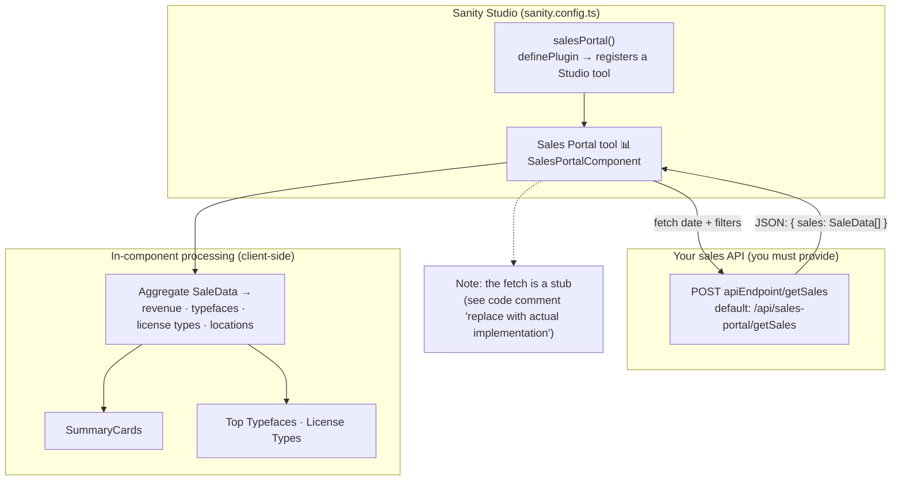

# Sanity Sales Portal Plugin

A sales dashboard and analytics tool for **Sanity Studio v3 through v6**, converted from the Darden Studio sales portal. It registers a **Sales Portal** tool in your Studio that aggregates order data into revenue totals, top-performing typefaces and license types, and geographic breakdowns — built on [`@sanity/ui`](https://www.sanity.io/ui) primitives (via a compat layer — see [Studio compatibility](#studio-compatibility)).

[](#studio-compatibility)
[](https://www.typescriptlang.org/)
[](#installation)
[](#known-issue-the-build-is-broken)
[](#license)

> **Status — internal / pre-release.** This package is **not published to npm**; the name `sanity-sales-portal` is unscoped and unclaimed on the registry, so `npm install sanity-sales-portal` returns a 404. Consume it by path or workspace (see [Installation](#installation)).
>
> Two things will stop you before the dashboard shows numbers:
> 1. **The build does not currently run** — `npm run build` fails outright. See [Known issue: the build is broken](#known-issue-the-build-is-broken).
> 2. The data-fetching layer ships as a **stub** — you provide the sales API. See [Connecting your data](#connecting-your-data).

> _Maintainer note:_ a live screenshot/GIF of the rendered dashboard would strengthen this README. The dashboard requires a running Studio plus a sales API, so it can't be captured headlessly — please drop a capture into `assets/` and embed it under [Features](#features).

## Architecture

How the tool gets, processes, and renders sales data:



<!-- Static fallback (renders where Mermaid does not, e.g. some registries). Regenerate with `npm run capture`. -->


## Features

- **📊 Sales Dashboard**: Monthly sales metrics rendered inside Sanity Studio
- **📈 Summary Cards**: Key performance indicators with period-over-period comparison
- **🎯 Top Performers**: Typeface and license type performance tracking
- **🌍 Location Analytics**: Geographic sales distribution analysis
- **📱 Responsive Design**: Built with Sanity UI components for consistent Studio integration
- **🔧 TypeScript**: Full type safety and excellent developer experience

> Some advertised knobs are scaffolded but not yet wired into the current component — see [Configuration Options](#configuration-options) for exactly what is and isn't read today.

## Installation

This package is **internal and unpublished** — there is no registry entry, and the name is unscoped, so it is not hiding under `@overpunch/` either. Consume it from source.

> [!IMPORTANT]
> `package.json` declares `"prepare": "rollup -c"`, so npm will try to build on install — **and that build currently fails** ([details](#known-issue-the-build-is-broken)). Until it is fixed, installing this package will error at the prepare step and no `dist/` will be produced. Fix the Rollup config first, or consume `src/` directly through your Studio's own bundler.

**1. Local path (most common).** From a Studio elsewhere on the same machine, point at the checkout — npm symlinks it, so edits are picked up immediately:

```bash
npm install file:../../tools/sanity-tools/sanity-sales-portal
```

**2. npm workspace.** If the consuming Studio and this package share an npm workspace tree:

```jsonc
// package.json of the consuming Studio
"dependencies": {
  "sanity-sales-portal": "*"
}
```

**3. Git URL.** Requires read access to the private repository:

```bash
npm install github:over-punch/sanity-sales-portal
```

The import specifier is `sanity-sales-portal` in every case, matching the `name` in `package.json`.

Peer dependencies you must already have in the consuming Studio: `sanity` `>=3 <7`, `react` / `react-dom` `^18 || ^19`, `@sanity/ui` `>=2 <5`, `styled-components` `^6`. See [Studio compatibility](#studio-compatibility) for why those ranges are correct.

### Known issue: the build is broken

`npm run build` (and therefore the `prepare` hook) fails. **This predates the current documentation pass and is recorded here so it is not forgotten — it is not something this README introduced.**

`rollup.config.js` mixes module systems: it uses an ESM `import` at the top *and* a CommonJS `require('typescript')` inside the plugin options, while `package.json` declares no `"type"` field. Node reparses the file as ESM because of the `import`, at which point `require` is not defined:

```js
import typescript from 'rollup-plugin-typescript2';   // ESM
// …
plugins: [
	typescript({
		typescript: require('typescript'),               // CJS — throws in ESM scope
	}),
],
```

```
[!] RollupError: Node tried to load your configuration as an ES module even though it is
    likely CommonJS…
Original error: require is not defined in ES module scope, you can use import instead
```

It loads as neither format. The fix is small — import `typescript` at the top alongside the plugin, rename the config to `.cjs`, or pass `--bundleConfigAsCjs` — but **no fix is applied here**; this section only documents the current state. Everything else in this README describes the source as written.

## Usage

### Basic Setup

Add the plugin to your Sanity configuration:

```typescript
import { defineConfig } from 'sanity';
import { salesPortal } from 'sanity-sales-portal';

export default defineConfig({
	// ... other config
	plugins: [
		salesPortal(),
		// ... other plugins
	],
});
```

`salesPortal()` registers a **Sales Portal** tool (📊) in the Studio's top navigation. The tool component fetches from the **default** endpoint `/api/sales-portal/getSales`.

### Custom Configuration (rendering the component directly)

> **Important:** `salesPortal()` currently takes **no options** and registers `SalesPortalComponent` with its default props. To pass `apiEndpoint`, `theme`, etc., render the component yourself (e.g. inside a custom Studio tool, a structure-builder view, or your own React tree) rather than relying on the plugin factory:

```typescript
import { SalesPortalComponent } from 'sanity-sales-portal';

// Custom usage with specific props (renders the dashboard wherever you mount it)
<SalesPortalComponent apiEndpoint="/api/custom-sales-endpoint" theme="dark" showSummaryCards={true} />;
```

## Configuration Options

### SalesPortalProps

These props are accepted by `SalesPortalComponent`. The **Read today?** column reflects what the current component actually consumes — the others are reserved for forthcoming chart/table/export work and have no effect yet.

| Property           | Type                         | Default               | Read today? | Description                 |
| ------------------ | ---------------------------- | --------------------- | ----------- | --------------------------- |
| `apiEndpoint`      | `string`                     | `'/api/sales-portal'` | ✅          | Base URL; the component POSTs to `${apiEndpoint}/getSales` |
| `theme`            | `'light' \| 'dark'`          | `'dark'`              | ✅          | Sets the card tone          |
| `showSummaryCards` | `boolean`                    | `true`                | ✅          | Display summary metrics     |
| `filters`          | `object`                     | `{}`                  | ✅          | Sent in the request body    |
| `dateRange`        | `{ start: Date; end: Date }` | -                     | ⏳          | Reserved (component drives off internal month state) |
| `showCharts`       | `boolean`                    | `true`                | ⏳          | Reserved (no charts rendered yet) |
| `showTables`       | `boolean`                    | `true`                | ⏳          | Reserved                    |
| `isAdmin`          | `boolean`                    | `false`               | ⏳          | Reserved (permissions)      |
| `allowExport`      | `boolean`                    | `false`               | ⏳          | Reserved (CSV export)       |

## Studio compatibility

| Peer | Range | Notes |
|---|---|---|
| `sanity` | `>=3 <7` | Studio v3, v4, v5 and v6 |
| `@sanity/ui` | `>=2 <5` | **Not a typo** — Studio v6 ships `@sanity/ui` **v4**, not v5 |
| `react` / `react-dom` | `^18 \|\| ^19` | |
| `styled-components` | `^6` | |

One build spans four consecutive Studio majors, which is why the ranges look odd at a glance.

`@sanity/ui` v4 moved `Tooltip`, `Menu`, `MenuButton`, `MenuItem`, `Code`, `Popover`, `Autocomplete`, `Toast` and `useToast` out of the package root into subpath entries, and `@sanity/icons` v5 removed every named `*Icon` export.

The trap: **both packages still *declare* the removed names in their `.d.ts`, typed `never`.** A named import type-checks, compiles green, and only then fails at runtime as an undefined component. TypeScript cannot see it, so a green build proves nothing about whether the dashboard renders.

This plugin therefore imports **no `@sanity/ui` or `@sanity/icons` symbol directly**. Every primitive routes through [`@overpunch/sanity-ui-compat`](https://www.npmjs.com/package/@overpunch/sanity-ui-compat), a direct dependency that resolves whichever namespace is actually installed at runtime:

```ts
// src/components/SummaryCards.tsx
import { Card, Grid, Heading, Text, Box, Flex, Badge, Stack } from '@overpunch/sanity-ui-compat';
```

Since Studio v6 ships `@sanity/ui` v4, the `>=2 <5` upper bound is correct rather than a stale ceiling.

> **Verification status.** v3–v6 support rests on the declared peer ranges alone. This package has **no test suite**, and — as noted above — **its build does not currently run**, so nothing here has been compiled or exercised against Sanity 6. Treat the ranges as intent, not proof.

## Data Structure

### Expected API Response Format

```typescript
interface SaleData {
	id: string;
	total: number; // in cents
	taxAmount?: number; // in cents
	shippingCost?: number; // in cents
	date: string;
	// Location analytics resolves country in this precedence order:
	// paymentMethod.origin.country → customerAddress.country → billingAddress.country
	customerAddress?: {
		country?: string;
	};
	billingAddress?: {
		country?: string;
	};
	paymentMethod?: {
		origin?: {
			country?: string;
		};
	};
	items?: SaleItem[];
	discountAmount?: number;
	refunds?: RefundData[];
}

interface SaleItem {
	id: string;
	name: string;
	quantity: number;
	price: number; // in cents
	licenseType?: string;
	designer?: string;
	typeface?: string;
}
```

> **Units:** every monetary value on the wire is in **cents** (`total`, `taxAmount`, `price`, …). The component converts to dollars internally via `centsToDollars` before display. The `formatCurrency` examples below take **dollars** because they format already-converted values.

## Connecting your data

The plugin ships a **stub** fetch (commented `// Mock API call - replace with actual implementation` in `SalesPortalComponent.tsx`). To make the dashboard show real numbers you must stand up the endpoint it calls.

The component issues:

```http
POST {apiEndpoint}/getSales
Content-Type: application/json

{
  "date": "2025-01-01T00:00:00.000Z",
  "filters": {
    "designer": "optional-designer-filter",
    "typeface": "optional-typeface-filter"
  }
}
```

and reads `data.sales` off the JSON response, so your endpoint must return:

```jsonc
{
  "sales": [
    /* Array of SaleData objects (see above) */
  ]
}
```

> **Common trap:** the response key is **`sales`**, not `data`. A `{ "data": [...] }` payload parses without error but leaves the dashboard permanently empty (it falls back to `[]`).

Because this is a Sanity plugin (served by Vite, not Next.js), `/api/sales-portal` is **not** a route inside the Studio — you host it separately and must handle CORS and auth for the Studio origin yourself.

## Components

### SalesPortalComponent

Main dashboard component with complete functionality.

### SummaryCards

Standalone summary metrics component.

```typescript
import { SummaryCards } from 'sanity-sales-portal';

<SummaryCards sales={salesData} previousSales={previousPeriodData} total={totalRevenue} revenueChangePercent={changePercent} locationData={locationStats} />;
```

## Utilities

```typescript
import { formatCurrency, formatPercentage, calculatePercentageChange, centsToDollars } from 'sanity-sales-portal';

const formattedAmount = formatCurrency(1234.56); // "$1,234.56"  (takes dollars)
const change = calculatePercentageChange(150, 100); // 50
const percentage = formatPercentage(change); // "+50.0%"
```

Also exported: `formatDate`, `formatDateAxis`, `dollarsToCents`, `getTrendDirection`, `truncateText`, `formatNumber`, `getOrdinalSuffix`, `capitalize`.

## Development

### Prerequisites

- Node.js 18+
- Sanity Studio v3, v4, v5 or v6 (see [Studio compatibility](#studio-compatibility))
- React 18 or 19

### Building from Source

```bash
git clone https://github.com/over-punch/sanity-sales-portal.git
cd sanity-sales-portal
npm install
npm run build
```

> ⚠️ `npm run build` currently **fails** — and because `prepare` runs it, `npm install` fails too. See [Known issue: the build is broken](#known-issue-the-build-is-broken) for the cause and the one-line fixes.

### Development Mode

```bash
npm run dev
```

### Regenerating the diagram

The architecture diagram is generated from `scripts/architecture.mmd`:

```bash
npm run capture   # requires @mermaid-js/mermaid-cli (npx mmdc)
```

When you regenerate, bump the `?v=N` cache-buster on the `assets/architecture.svg` URL above.

## Integration with Existing Sales Systems

This plugin is designed to work with existing e-commerce and sales systems. You'll need to:

1. **Create API endpoints** that match the expected data format (return `{ sales: [...] }`)
2. **Configure authentication** for sales data access
3. **Set up data processing** to convert your sales data to the expected format
4. **Implement filtering** based on your business requirements

## Customization

### Styling

The plugin uses Sanity UI components, which automatically adapt to your Studio theme. The `theme` prop additionally toggles the card tone.

### Data Processing

Mount `SalesPortalComponent` inside your own wrapper to apply custom configuration or pre-process data — for example, point it at a transformed endpoint:

```typescript
import { SalesPortalComponent } from 'sanity-sales-portal';

const CustomSalesPortal = () => {
	// Wire the dashboard to your own processing endpoint
	return <SalesPortalComponent apiEndpoint="/api/my-processed-sales" theme="dark" />;
};
```

## License

MIT License. This package declares `"license": "MIT"` in `package.json`; a standalone `LICENSE` file is not yet bundled.

## Contributing

1. Fork the repository
2. Create a feature branch
3. Make your changes
4. Add tests if applicable
5. Submit a pull request

## Roadmap

The current release renders summary cards and top-performer panels. Not yet implemented (props are scaffolded — see the table above):

- Charts (`ChartData` types exist; nothing renders them yet)
- Tables, CSV export, and admin-gated views
- Previous-period fetch (`previousSales` / `revenueChangePercent` are wired through `SummaryCards` but not yet populated)

## Changelog

### v1.0.0

- Initial release
- Sales dashboard with summary cards and top performers
- TypeScript support
- Sanity UI integration
- Responsive design
- Location analytics

## Support

For support, please open an issue on the [GitHub repository](https://github.com/over-punch/sanity-sales-portal) or contact [support@liiift.studio](mailto:support@liiift.studio).

---

**Built with ❤️ by [Liiift Studio](https://liiift.studio)**
