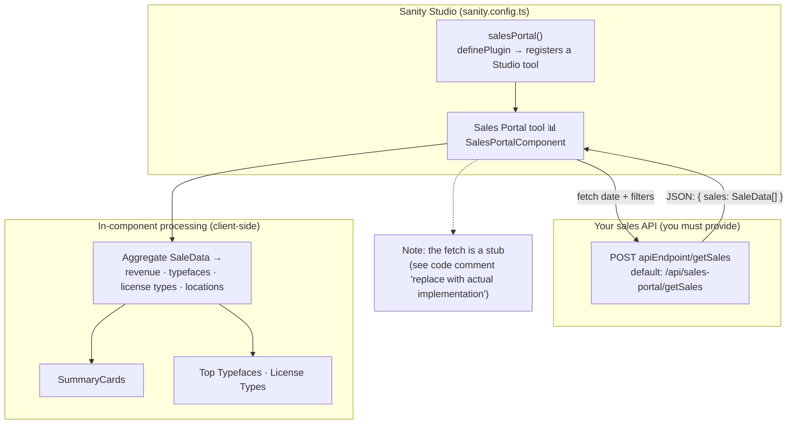

# Sanity Sales Portal Plugin

A sales dashboard and analytics tool for **Sanity Studio v3**, converted from the Darden Studio sales portal. It registers a **Sales Portal** tool in your Studio that aggregates order data into revenue totals, top-performing typefaces and license types, and geographic breakdowns — built entirely with [`@sanity/ui`](https://www.sanity.io/ui).

[](https://www.sanity.io/)
[](https://www.typescriptlang.org/)
[](#license)

> **Status — internal / pre-release.** This package is **not published to npm**; install it from source (see [Installation](#installation)). The data-fetching layer ships as a **stub** — you provide the sales API. See [Connecting your data](#connecting-your-data) before expecting the dashboard to show numbers.

> _Maintainer note:_ a live screenshot/GIF of the rendered dashboard would strengthen this README. The dashboard requires a running Studio plus a sales API, so it can't be captured headlessly — please drop a capture into `assets/` and embed it under [Features](#features).

## Architecture

How the tool gets, processes, and renders sales data:



<!-- Static fallback (renders where Mermaid does not, e.g. some registries). Regenerate with `npm run capture`. -->


## Features

- **📊 Sales Dashboard**: Monthly sales metrics rendered inside Sanity Studio
- **📈 Summary Cards**: Key performance indicators with period-over-period comparison
- **🎯 Top Performers**: Typeface and license type performance tracking
- **🌍 Location Analytics**: Geographic sales distribution analysis
- **📱 Responsive Design**: Built with Sanity UI components for consistent Studio integration
- **🔧 TypeScript**: Full type safety and excellent developer experience

> Some advertised knobs are scaffolded but not yet wired into the current component — see [Configuration Options](#configuration-options) for exactly what is and isn't read today.

## Installation

This package is **not on npm**. Install it from the repository (it builds on `prepare`, so the `dist/` output is generated on install):

```bash
# From a git URL
npm install github:Liiift-Studio/sanity-sales-portal

# …or, inside this monorepo, from a local path
npm install ../tools/sanity-tools/sanity-sales-portal
```

Peer dependencies you must already have in the consuming Studio: `sanity` ^3, `react` / `react-dom` ^18, `@sanity/ui` ^2, `styled-components` ^6.

## Usage

### Basic Setup

Add the plugin to your Sanity configuration:

```typescript
import { defineConfig } from 'sanity';
import { salesPortal } from 'sanity-sales-portal';

export default defineConfig({
	// ... other config
	plugins: [
		salesPortal(),
		// ... other plugins
	],
});
```

`salesPortal()` registers a **Sales Portal** tool (📊) in the Studio's top navigation. The tool component fetches from the **default** endpoint `/api/sales-portal/getSales`.

### Custom Configuration (rendering the component directly)

> **Important:** `salesPortal()` currently takes **no options** and registers `SalesPortalComponent` with its default props. To pass `apiEndpoint`, `theme`, etc., render the component yourself (e.g. inside a custom Studio tool, a structure-builder view, or your own React tree) rather than relying on the plugin factory:

```typescript
import { SalesPortalComponent } from 'sanity-sales-portal';

// Custom usage with specific props (renders the dashboard wherever you mount it)
<SalesPortalComponent apiEndpoint="/api/custom-sales-endpoint" theme="dark" showSummaryCards={true} />;
```

## Configuration Options

### SalesPortalProps

These props are accepted by `SalesPortalComponent`. The **Read today?** column reflects what the current component actually consumes — the others are reserved for forthcoming chart/table/export work and have no effect yet.

| Property           | Type                         | Default               | Read today? | Description                 |
| ------------------ | ---------------------------- | --------------------- | ----------- | --------------------------- |
| `apiEndpoint`      | `string`                     | `'/api/sales-portal'` | ✅          | Base URL; the component POSTs to `${apiEndpoint}/getSales` |
| `theme`            | `'light' \| 'dark'`          | `'dark'`              | ✅          | Sets the card tone          |
| `showSummaryCards` | `boolean`                    | `true`                | ✅          | Display summary metrics     |
| `filters`          | `object`                     | `{}`                  | ✅          | Sent in the request body    |
| `dateRange`        | `{ start: Date; end: Date }` | -                     | ⏳          | Reserved (component drives off internal month state) |
| `showCharts`       | `boolean`                    | `true`                | ⏳          | Reserved (no charts rendered yet) |
| `showTables`       | `boolean`                    | `true`                | ⏳          | Reserved                    |
| `isAdmin`          | `boolean`                    | `false`               | ⏳          | Reserved (permissions)      |
| `allowExport`      | `boolean`                    | `false`               | ⏳          | Reserved (CSV export)       |

## Data Structure

### Expected API Response Format

```typescript
interface SaleData {
	id: string;
	total: number; // in cents
	taxAmount?: number; // in cents
	shippingCost?: number; // in cents
	date: string;
	// Location analytics resolves country in this precedence order:
	// paymentMethod.origin.country → customerAddress.country → billingAddress.country
	customerAddress?: {
		country?: string;
	};
	billingAddress?: {
		country?: string;
	};
	paymentMethod?: {
		origin?: {
			country?: string;
		};
	};
	items?: SaleItem[];
	discountAmount?: number;
	refunds?: RefundData[];
}

interface SaleItem {
	id: string;
	name: string;
	quantity: number;
	price: number; // in cents
	licenseType?: string;
	designer?: string;
	typeface?: string;
}
```

> **Units:** every monetary value on the wire is in **cents** (`total`, `taxAmount`, `price`, …). The component converts to dollars internally via `centsToDollars` before display. The `formatCurrency` examples below take **dollars** because they format already-converted values.

## Connecting your data

The plugin ships a **stub** fetch (commented `// Mock API call - replace with actual implementation` in `SalesPortalComponent.tsx`). To make the dashboard show real numbers you must stand up the endpoint it calls.

The component issues:

```http
POST {apiEndpoint}/getSales
Content-Type: application/json

{
  "date": "2025-01-01T00:00:00.000Z",
  "filters": {
    "designer": "optional-designer-filter",
    "typeface": "optional-typeface-filter"
  }
}
```

and reads `data.sales` off the JSON response, so your endpoint must return:

```jsonc
{
  "sales": [
    /* Array of SaleData objects (see above) */
  ]
}
```

> **Common trap:** the response key is **`sales`**, not `data`. A `{ "data": [...] }` payload parses without error but leaves the dashboard permanently empty (it falls back to `[]`).

Because this is a Sanity plugin (served by Vite, not Next.js), `/api/sales-portal` is **not** a route inside the Studio — you host it separately and must handle CORS and auth for the Studio origin yourself.

## Components

### SalesPortalComponent

Main dashboard component with complete functionality.

### SummaryCards

Standalone summary metrics component.

```typescript
import { SummaryCards } from 'sanity-sales-portal';

<SummaryCards sales={salesData} previousSales={previousPeriodData} total={totalRevenue} revenueChangePercent={changePercent} locationData={locationStats} />;
```

## Utilities

```typescript
import { formatCurrency, formatPercentage, calculatePercentageChange, centsToDollars } from 'sanity-sales-portal';

const formattedAmount = formatCurrency(1234.56); // "$1,234.56"  (takes dollars)
const change = calculatePercentageChange(150, 100); // 50
const percentage = formatPercentage(change); // "+50.0%"
```

Also exported: `formatDate`, `formatDateAxis`, `dollarsToCents`, `getTrendDirection`, `truncateText`, `formatNumber`, `getOrdinalSuffix`, `capitalize`.

## Development

### Prerequisites

- Node.js 18+
- Sanity Studio v3+
- React 18+

### Building from Source

```bash
git clone https://github.com/Liiift-Studio/sanity-sales-portal.git
cd sanity-sales-portal
npm install
npm run build
```

### Development Mode

```bash
npm run dev
```

### Regenerating the diagram

The architecture diagram is generated from `scripts/architecture.mmd`:

```bash
npm run capture   # requires @mermaid-js/mermaid-cli (npx mmdc)
```

When you regenerate, bump the `?v=N` cache-buster on the `assets/architecture.svg` URL above.

## Integration with Existing Sales Systems

This plugin is designed to work with existing e-commerce and sales systems. You'll need to:

1. **Create API endpoints** that match the expected data format (return `{ sales: [...] }`)
2. **Configure authentication** for sales data access
3. **Set up data processing** to convert your sales data to the expected format
4. **Implement filtering** based on your business requirements

## Customization

### Styling

The plugin uses Sanity UI components, which automatically adapt to your Studio theme. The `theme` prop additionally toggles the card tone.

### Data Processing

Mount `SalesPortalComponent` inside your own wrapper to apply custom configuration or pre-process data — for example, point it at a transformed endpoint:

```typescript
import { SalesPortalComponent } from 'sanity-sales-portal';

const CustomSalesPortal = () => {
	// Wire the dashboard to your own processing endpoint
	return <SalesPortalComponent apiEndpoint="/api/my-processed-sales" theme="dark" />;
};
```

## License

MIT License. This package declares `"license": "MIT"` in `package.json`; a standalone `LICENSE` file is not yet bundled.

## Contributing

1. Fork the repository
2. Create a feature branch
3. Make your changes
4. Add tests if applicable
5. Submit a pull request

## Roadmap

The current release renders summary cards and top-performer panels. Not yet implemented (props are scaffolded — see the table above):

- Charts (`ChartData` types exist; nothing renders them yet)
- Tables, CSV export, and admin-gated views
- Previous-period fetch (`previousSales` / `revenueChangePercent` are wired through `SummaryCards` but not yet populated)

## Changelog

### v1.0.0

- Initial release
- Sales dashboard with summary cards and top performers
- TypeScript support
- Sanity UI integration
- Responsive design
- Location analytics

## Support

For support, please open an issue on the [GitHub repository](https://github.com/Liiift-Studio/sanity-sales-portal) or contact [support@liiift.studio](mailto:support@liiift.studio).

---

**Built with ❤️ by [Liiift Studio](https://liiift.studio)**
